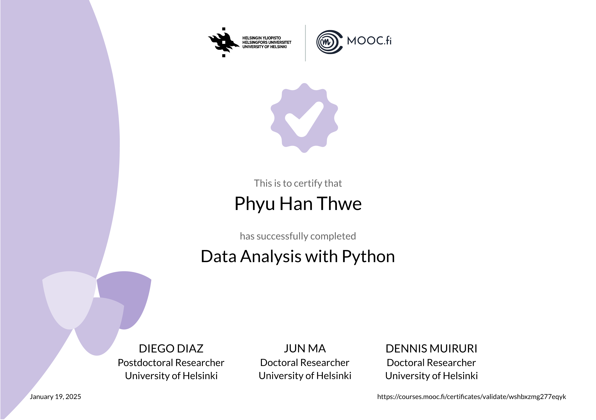

# Data Analysis with Python 2024-2025

This is a course offered as MOOC by the University of Helsinki.

## Content

### Libraries
- Numpy
- Pandas
- Scikit-learn
- (Matplotlib)

### Interactive Study Materials
- Jupyter notebook

### Automatic Checking of Exercises
- Test My Code framework

### Basics of Python Language

### Numpy
- Creation and indexing of arrays
- Array concatenation and splitting
- Fast computation using universal functions
- Summary statistics
- Broadcasting
- Matrix operations and basic linear algebra

### Pandas
- Creating and indexing of Series and DataFrames
- Handling missing data
- Concatenation of Series and DataFrames
- Grouping and aggregating
- Merging DataFrames

### Gentle Introduction to Machine Learning through Scikit-learn Library
- Linear regression
- Naive Bayes classification
- Principal component analysis
- k-means clustering

### Project
- Applying the learned skills on an application field

